<h1 align='center'>Laboratorio 1</h1>
<h3 align='center'>Git y GitHub</h3>

Alumno: Carlo Rodrigo Diaz Portilla

<h2>I. Objetivos</h2>

Aprender a manejar un sistema de control de versiones de manera colaborativa con varios usuarios

<h2>II. Temas a tratar</h2>
<ul>
	<li>Git</li>
	<li>Git-Hub</li>
</ul>
<h2>III. Desarrollo</h2>
<h3>A. git init</h3>

Iniciamos el repositorio local, se crea directorio oculto .git

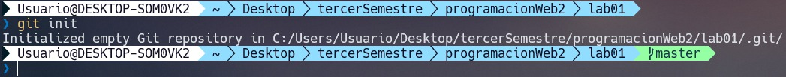
<h3>B. git config</h3>

Configuramos el correo y nombre

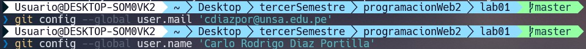
<h3>C. git status</h3>

Crearemos un archivo, para este ejemplo HolaMundo.java

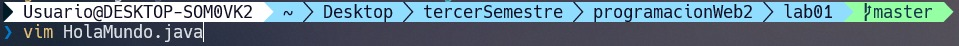

Editamos el archivo con el template básico de java y guardaremos

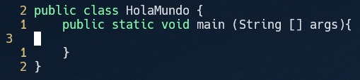

Entonces ejecutaremos <code>git status</code> y notaremos que nos avisa que debemos agregar el archivo al staging area

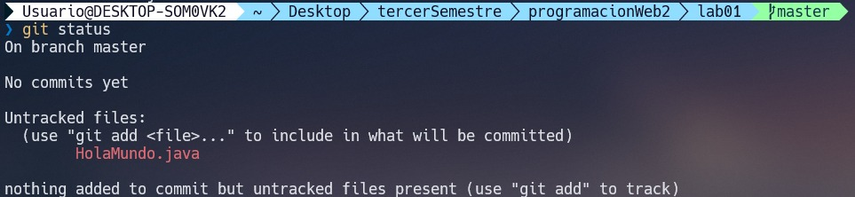
<h3>D. Archivo .gitignore</h3>

El archivo .gitignore para indicar archivos que no queremos agregar al staging area

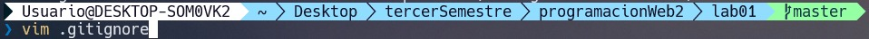

No queremos agregar archivos .class y tampoco el mismo .gitignore

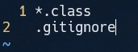
<h3>E. git add</h3>

Para agregar el archivo al staging area deberemos ejecutar <code>git add fileName</code>

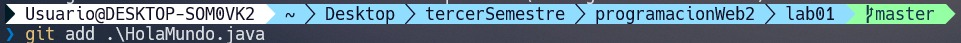
<h3>F. git commit</h3>

Una vez en el staging area, los archivos están listos para hacer commit

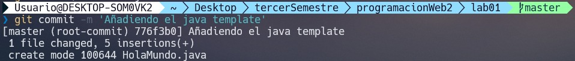

Haremos 2 commit más

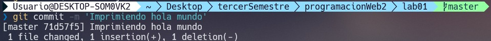
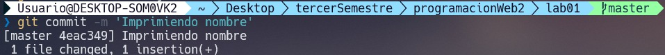
<h3>G. git show</h3>

<code>git show</code> nos muestra detalles acerca del commit actual

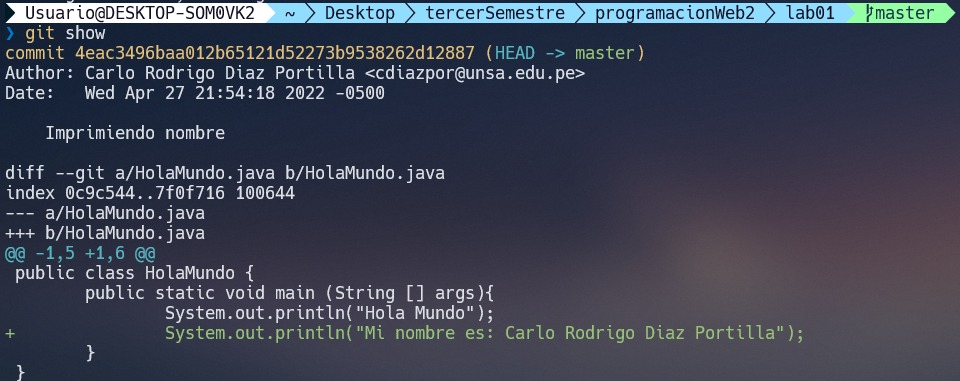
<h3>H. git log</h3>

<code>git log</code> para ver resumen de los commits realizados, podemos agregarle parámetros de formato como en el ejemplo

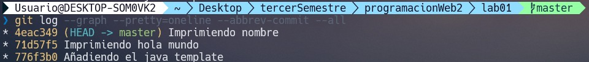
<h3>I. Conexión con el repositorio remoto(GitHub)</h3>

Tendremos que ejecutar una serie de comandos para conectar con el repositorio remoto

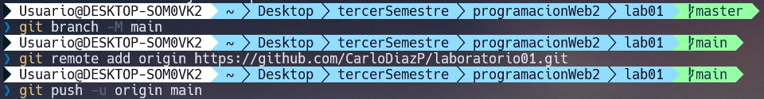
